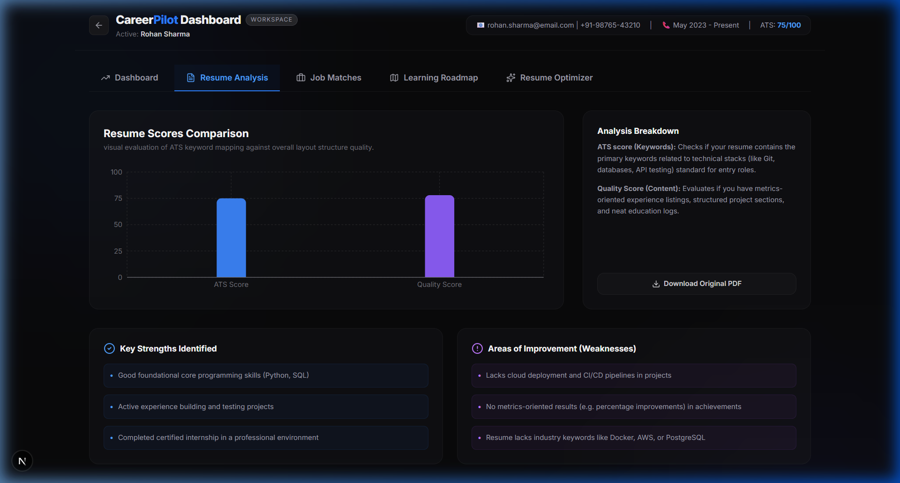
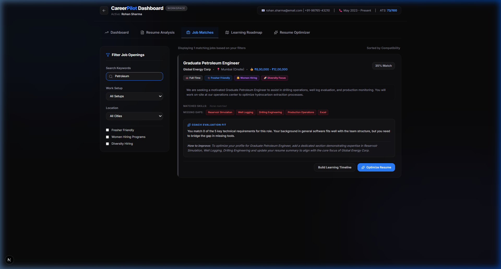
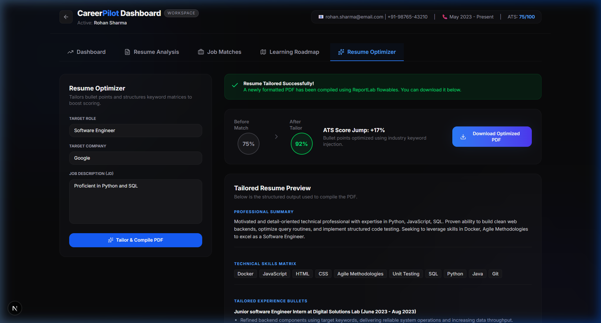
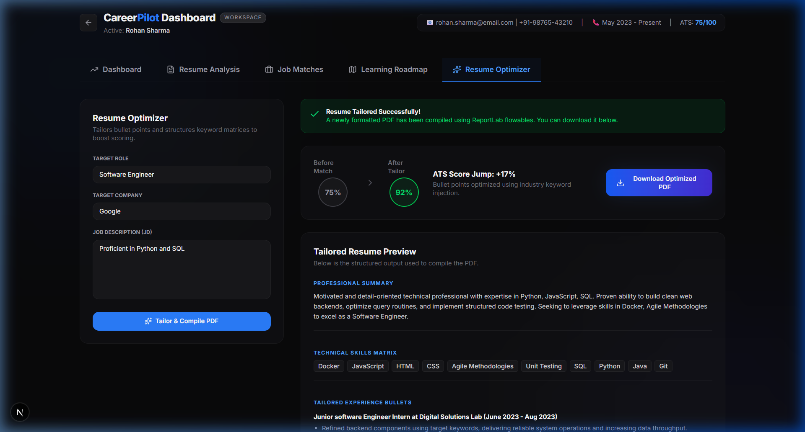

# CareerPilot 🚀 - AI-Powered Career Coach Agent

**CareerPilot** is an intelligent, end-to-end AI career mentor designed for students, fresh graduates, internship seekers, and entry-level professionals. It evaluates candidate resumes, calculates industry readiness, maps skill gaps, builds custom study curricula, and tailors resumes for targeted job openings with programmatically generated PDFs.

Built for the **AI Agent Competition**, CareerPilot demonstrates a real, connected agentic workflow using the Google Gemini API as the sole AI provider.

---

## Key Features

1. **AI Resume SWOT Analysis**: Analyzes resume PDFs to extract skills, education, projects, experience, and evaluate ATS compatibility and overall content quality.
2. **Career Readiness Score (0-100)**: Combines resume SWOT details, project depth, and skill gaps to provide a single, showcase-ready readiness index and a concrete checklist to cross 90+.
3. **Smart Job Match Engine**: Compares the candidate profile against a local database of 10 postings, displaying compatibility, missing skill gaps, and custom improvement advice.
4. **Interactive Learning Roadmap**: Generates a tailored 4-month month-by-month syllabus for the candidate's target job role, specifying learning resources, weekly milestones, and hands-on mini-projects.
5. **ATS Resume Tailor**: Rewrites experience bullet points and structures keyword lists for a specific role and company, outputting a downloadable, professionally formatted PDF.
6. **Sandbox Sandbox (1-Click Test)**: Pre-compiled sample resumes are built-in so judges or testers can evaluate the entire application with one click, without needing to upload custom files.

---

## Tech Stack

* **Frontend**: Next.js 15, TypeScript, Tailwind CSS (Tailwind v4), Zustand (Global State), Recharts (SWOT Graphing), Lucide React (Icons).
* **Backend**: FastAPI (Python), SQLite (Database), SQLAlchemy (ORM), PyMuPDF & pdfplumber (PDF extraction), ReportLab (PDF resume compilation).
* **AI Engine**: Google Gemini API (`gemini-1.5-flash`).

---

## Folder Structure

```
careerpilot/
├── backend/
│   ├── app/
│   │   ├── data/
│   │   │   ├── sample_resumes/  # Holds pre-generated test PDFs
│   │   │   ├── generate_samples.py # Script to compile sample resumes
│   │   │   └── jobs.json        # Prepopulated job database (10 jobs)
│   │   ├── services/
│   │   │   ├── gemini_service.py   # AI prompts and mock fallback handlers
│   │   │   ├── resume_parser.py    # PyMuPDF text extraction logic
│   │   │   ├── job_service.py      # Matching and filtering filters
│   │   │   └── optimizer_service.py # ReportLab resume compiler
│   │   ├── config.py
│   │   ├── database.py
│   │   ├── models.py
│   │   ├── schemas.py
│   │   └── main.py              # FastAPI application routers
│   ├── uploads/                 # Storage for uploaded files
│   ├── requirements.txt         # Backend Python dependencies
│   ├── test_backend.py          # Backend automation verification script
│   └── .env                     # Configuration file
├── frontend/
│   ├── public/
│   ├── src/
│   │   ├── app/
│   │   │   ├── dashboard/       # Main workspace components
│   │   │   ├── globals.css      # Dark theme HSL and CSS style settings
│   │   │   ├── layout.tsx       # SEO metadata and Google font loaders
│   │   │   └── page.tsx         # Sleek landing page with upload dropzone
│   │   ├── store/
│   │   │   └── useStore.ts      # Zustand global state manager
│   ├── package.json
│   └── tsconfig.json
└── .env.example                 # Root configuration template
```

---

## Environment Setup

### 1. Gemini API Key (Required)
CareerPilot requires a Google Gemini API Key.
* **Cost**: Free tier available (up to 15 RPM).
* **How to obtain**:
  1. Visit the [Google AI Studio Console](https://aistudio.google.com/).
  2. Log in with your Google account.
  3. Click **Get API Key** and create a new key.
* **Where to place it**:
  Copy the `.env.example` in the root workspace into a new file called `.env` in the `backend/` folder:
  ```env
  GEMINI_API_KEY=AIzaSy...your_gemini_api_key...
  DATABASE_URL=sqlite:///./careerpilot.db
  UPLOAD_FOLDER=./uploads
  ```
  *(If the API key is left blank, CareerPilot runs in an offline **Sandbox Fallback Mode**, generating realistic mock feedback so the UI remains fully functional and evaluatable).*

---

## Localhost Run Instructions

### 1. Launch Backend Server

First, install the Python requirements:
```bash
cd backend
pip install -r requirements.txt
```

Verify your backend service scripts work by running the automated script. This will compile all sample resume PDFs and check database connectivity:
```bash
python test_backend.py
```

Now, launch the FastAPI server using Uvicorn:
```bash
uvicorn app.main:app --reload
```
The backend API is now running at `http://localhost:8000`. You can inspect the interactive Swagger docs at `http://localhost:8000/docs`.

---

### 2. Launch Frontend Application

In a new terminal window:
```bash
cd frontend
npm install
npm run dev
```
The Next.js user portal is now running at `http://localhost:3000`.

---

## How to Test and Evaluate

1. Open your browser and navigate to `http://localhost:3000`.
2. **Sandbox Testing**: Under the drag-and-drop zone, you will see a list of pre-configured candidate profiles (e.g. *Software Freshman*, *Data Analyst*, *React Frontend Dev*, *Unoptimized Resume*). Click on any of them.
3. CareerPilot will immediately parse, evaluate, precompute job matches, calculate readiness scores, and open the Workspace Dashboard:
   * **Dashboard Tab**: Check the circular readiness gauge and see the coaching checklist to reach 90+ score.
   * **Resume Analysis**: See the ATS Score and Quality Score, review detailed SWOT listings, and verify missing keywords.
   * **Job Matches**: Review computed compatibility scores, matched/missing skill grids, and mentor advice.
   * **Learning Roadmap**: Type in any career target (e.g. "DevOps Engineer") and build a month-by-month syllabus containing goals, practice milestones, free resources, and hands-on projects.
   * **Resume Optimizer**: Click "Optimize Resume" on any job card. Review before/after match scores (e.g. from 70% to 92%+), preview tailored experiences, and click **Download Optimized PDF** to open the programmatically generated resume in your local reader.
4. **Manual Upload**: Click the back arrow at the top left of the dashboard to return to the landing page and drag-and-drop any custom PDF resume to analyze your own profile!

---

## Agent Walkthrough & Screenshots

### 1. Resume SWOT Analysis
Evaluates parsed resume text against key industry competencies and structures strengths, weaknesses, missing keywords, and recommendations.


### 2. Multi-Disciplinary Job Matches
Compares the candidate's technical skills profile against the jobs database and filters results dynamically. 


### 3. Star-Method Resume Tailoring
Rewrites achievements using the STAR methodology to match target job requirements.


### 4. PDF Resume Generation
Compiles a professionally typeset, ATS-optimized PDF ready for submission.

